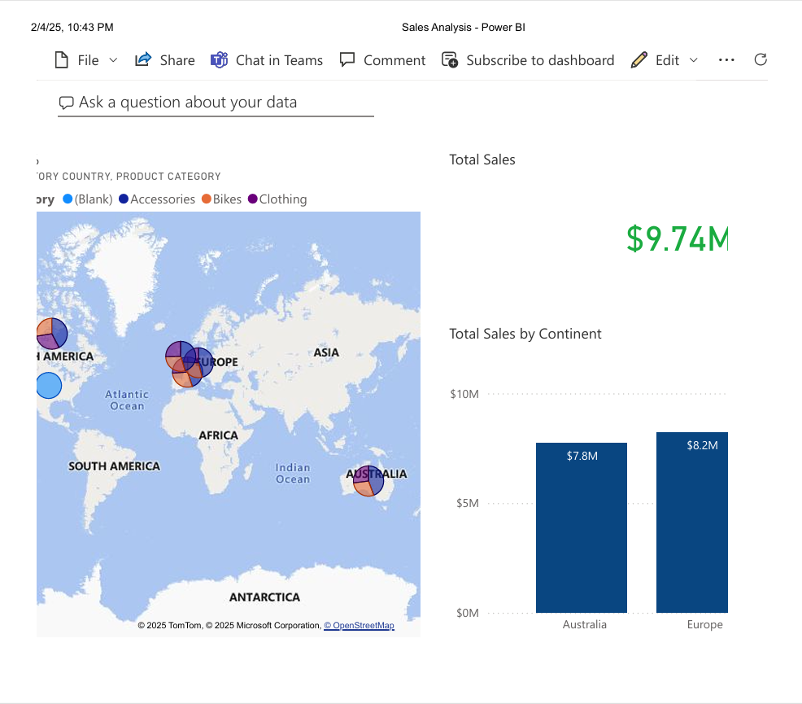

# PowerBI-Sales-
Power BI Sales dashboard on Sales dataset
# Power BI Sales Dashboard

This repository contains a **Sales Dashboard** created using Microsoft Power BI, as part of the **Complete Guide to Power BI for Data Analysts by Microsoft Press** course on LinkedIn Learning. The dashboard provides insightful visualizations into sales performance, margins, and total sales across continents, allowing businesses to make informed decisions.

## Project Summary

The Power BI project demonstrates the following features:

- **Data Import and Transformation:** Data was imported and transformed using the Power Query Editor.
- **Data Modeling:** Relationships between datasets were established, and measures were created using DAX.
- **Visualizations:** Interactive and dynamic visuals were created to enhance the storytelling of the sales data.
- **Power BI Service:** The dashboard was published and shared using the Power BI Service.

## Visualizations

The dashboard provides insights into:

1. **Total Sales and Target:**
   - Displays the total sales achieved and the set target.
   - Helps monitor overall sales performance.

2. **Total Sales by Continent:**
   - Bar chart comparing total sales across continents (Australia, Europe, North America).
   - Useful for identifying the strongest sales regions.

3. **Sales Performance Over Time:**
   - Line chart visualizing sales trends over time.
   - Highlights growth patterns and periods of peak performance.

4. **Margin % by Product Category:**
   - Bar chart showing margin percentages for different product categories (Accessories, Bikes, Clothing, etc.).
   - Assists in identifying the most profitable product categories.

### Dashboard Overview


## Technologies Used

- **Power BI Desktop**: For creating the dashboard.
- **Power Query**: For data import and transformation.
- **DAX**: For measures and calculated columns.
- **Power BI Service**: For dashboard publishing and sharing.

## How to Use

1. Clone this repository:
   ```bash
   git clone https://github.com/yourusername/powerbi-sales-dashboard.git
   cd powerbi-sales-dashboard

